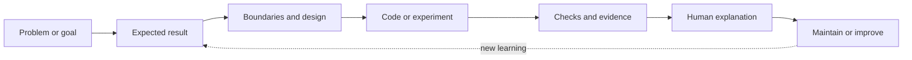

# Explainable Engineering Method (EEM)

EEM is a practical way to build software and other technical systems so people can understand how they work, check that they work, and change them safely later.

It is useful for software, AI and data projects, mobile and web apps, games, embedded systems, and projects where an AI assistant helps write or change the code.

## Why this exists

AI can help create code quickly. That still leaves important questions for the people who own and maintain the system:

- What problem does this part solve?
- Where is it implemented?
- What can it do, and where does it stop?
- How do we know it works?
- What should we check first when it fails?

EEM keeps those answers connected. It helps a team move from an idea to a working change with a clear path through the code and the evidence behind it.

## EEM in one picture

The loop is deliberately simple:

1. Decide what outcome matters.
2. Describe what success looks like.
3. Define the important boundaries and failure cases.
4. Make a bounded change or run a focused experiment.
5. Check the result and record what the check actually proves.
6. Make sure the responsible person can explain the relevant part of the system.

The loop can be lightweight for a small change and more detailed when the consequences are higher.

## A small example

Imagine a system that receives an image and returns a quality grade.

An EEM record would make the boundary clear:

| Question | Example answer |
|---|---|
| Purpose | Return a quality grade from an image |
| Input | An image in the documented format |
| Output | A grade, or a defined failure result |
| Depends on | An image-processing model and its version |
| Does not do | Move hardware, save records, or draw the user interface |
| Failure cases | No object found, model unavailable, confidence too low |
| Evidence | Tests and evaluation results for the agreed conditions |
| First debugging step | Check the image input and model result before checking later components |

The code can still use the project’s normal folders and framework. EEM supplies the map and the questions that make the boundary understandable.

## A few terms in plain English

| EEM term | Plain meaning |
|---|---|
| Requirement | A behavior or constraint the system is expected to meet |
| Acceptance criterion | An observable condition used to decide whether one result is acceptable |
| Contract | What a component needs, promises, and does when something goes wrong |
| Evidence | An inspectable result that supports a specific claim |
| Traceability | A path connecting a requirement, a code boundary, a check, and its result |
| Work Record | A short, maintained record for a feature, bug, refactor, migration, or experiment |
| Human explanation check | A walkthrough showing that the responsible person can locate and explain the relevant behavior |

EEM keeps intended behavior, implementation, and verification results separate. A specification describes what should happen; a test result records what was observed.

## Choose the amount of detail you need

EEM does not require every task to produce a large set of documents.

- **Lightweight:** a short outcome, boundary, acceptance check, and code/result link.
- **Standard:** a Work Record, relevant failure cases, design rationale, and verification evidence.
- **Heightened:** additional review, failure analysis, compatibility or recovery planning, and specialist evidence when the consequences or recovery difficulty justify it.

The goal is useful understanding and evidence. File count is not a measure of good engineering.

## Who is it for?

EEM is for people who need to build or maintain a system and still understand it later. That includes students, individual developers, engineering teams, reviewers, and people working with AI-assisted development.

You do not need to be an expert in every line of code. You do need a reliable way to explain the parts you own and to find the right place to investigate when something fails.

## Start here

For a first trial, choose one small piece of work:

1. Write down the desired result and how you will recognize it.
2. Locate the relevant code, data, or external boundary.
3. Make the smallest useful change.
4. Run the checks that support the agreed result.
5. Record limitations or unknowns instead of hiding them.
6. Walk through one normal case and one failure case with the person responsible for the system.

Use an existing issue, task, or pull request as the Work Record when it already contains the needed information.

## What is in this repository?

| Path | What it contains |
|---|---|
| [`explainable-engineering-method/SKILL.md`](explainable-engineering-method/SKILL.md) | Instructions for applying EEM with an AI assistant |
| [`references/method.md`](explainable-engineering-method/references/method.md) | The complete method specification |
| [`references/workflows.md`](explainable-engineering-method/references/workflows.md) | Workflows for new systems, existing code, changes, bugs, incidents, refactors, migrations, and experiments |
| [`references/templates.md`](explainable-engineering-method/references/templates.md) | Reusable records for work, decisions, evidence, traceability, handoffs, and explanation checks |
| [`references/examples.md`](explainable-engineering-method/references/examples.md) | Worked examples using fictional projects and results |
| [`references/trial-plan.md`](explainable-engineering-method/references/trial-plan.md) | A plan for testing and improving EEM in real project work |
| [`VALIDATION.md`](VALIDATION.md) | Checks completed and known validation limits for this package |

## Use it with an AI assistant

Give the assistant a bounded request, such as:

> Use EEM to inspect this existing project and map one capability from its requirement through code to the available verification. Record unknowns and propose the smallest useful next change.

Or:

> Use EEM to implement this change. Keep the Work Record lightweight, verify the agreed behavior, and help me explain its boundaries and failure cases.

The assistant should keep implementation, verification, human explanation, and release status separate. It should report when evidence was not run or needs reassessment.

## Current status

This repository contains EEM v0.1, an operational draft for trial. It is a method proposal, not a validated standard. The trial plan explains how to learn whether it improves understanding and maintenance without adding unnecessary process.

The package is self-contained and can be adapted to a project’s existing architecture, tools, and documentation style.
